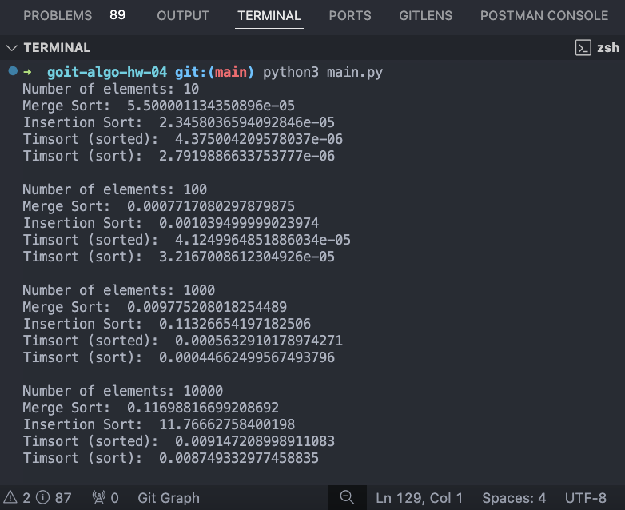

# Домашнє завдання до теми “Алгоритми сортування”

Вітаємо 🌞

Налаштовані застосовувати алгоритми сортування? Тоді беремося за роботу!

Алгоритми сортування є важливим інструментом в арсеналі кожного програміста, здатним допомогти в ефективному управлінні та обробці даних. У світі програмування, де швидкість та ефективність є ключовими, вибір правильного алгоритму сортування може суттєво вплинути на продуктивність програми.

У цьому завданні ви порівняєте три різних алгоритми сортування, перевірите їх ефективність на різних наборах даних, використовуючи модуль `timeit` для вимірювання часу виконання.

Вивчення роботи цих алгоритмів та їх порівняння допоможе вам зрозуміти, чому програмісти найчастіше використовують вбудовані алгоритми замість написання власних.

Це завдання не лише поглибить ваше розуміння алгоритмів сортування, але й надасть конкретні дані для аналізу та висновків щодо їх ефективності.

А для тих, хто хоче поглибитись у алгоритми сортування, запропоновано також додаткове опціональне завдання. Бажаємо успіхів! 😎

## Опис домашнього завдання

Python має дві вбудовані функції сортування: `sorted` і `sort`. Функції сортування Python використовують Timsort — гібридний алгоритм сортування, що поєднує в собі сортування злиттям і сортування вставками.

Порівняйте три алгоритми сортування: злиттям, вставками та Timsort за часом виконання. Аналіз повинен бути підтверджений емпіричними даними, отриманими шляхом тестування алгоритмів на різних наборах даних. Емпірично перевірте теоретичні оцінки складності алгоритмів, наприклад, сортуванням на великих масивах. Для заміру часу виконання алгоритмів використовуйте модуль timeit.

Покажіть, що поєднання сортування злиттям і сортування вставками робить алгоритм Timsort набагато ефективнішим, і саме з цієї причини програмісти, в більшості випадків, використовують вбудовані в Python алгоритми, а не кодують самі. Зробіть висновки.

**Необов'язкове завдання**

Дано `k` відсортованих списків цілих чисел. Ваше завдання — об'єднати їх у один відсортований список. При виконанні завдання можете опиратися на алгоритм сортування злиттям з конспекту. Реалізуйте функцію `merge_k_lists`, яка приймає на вхід список відсортованих списків та повертає відсортований список.

Приклад очікуваного результату:

```Python
lists = [[1, 4, 5], [1, 3, 4], [2, 6]]
merged_list = merge_k_lists(lists)
print("Відсортований список:", merged_list)
```

Виведення:

```Python
Відсортований список: [1, 1, 2, 3, 4, 4, 5, 6]
```

### Підготовка та завантаження домашнього завдання

1. Створіть публічний репозиторій goit-algo-hw-04.

2. Виконайте завдання та відправте його у свій репозиторій.

3. Завантажте робочий файл на свій комп’ютер та прикріпіть його у LMS у форматі `zip`. Назва архіву повинна бути у форматі ДЗ4_ПІБ.

4. Прикріпіть посилання на репозиторій `goit-algo-hw-04` та відправте на перевірку.

### Формат здачі

Прикріплений файл репозиторію у форматі `zip` з назвою ДЗ4_ПІБ.
Посилання на репозиторій.

### Критерії прийняття ДЗ

Прикріплені посилання на репозиторій `goit-algo-hw-04` та безпосередньо сам файл репозиторію у форматі `zip`.
Виконано порівняльний аналіз алгоритмів за часом виконання шляхом їх тестування на різних наборах даних.
Емпірично перевірено теоретичні оцінки складності алгоритмів та доведено, що поєднання сортування злиттям і сортування вставками робить алгоритм Timsort набагато ефективнішим.
Зроблено висновки щодо ефективності алгоритмів для даного випадку. Висновки оформлено у вигляді файлу readme.md до домашнього завдання.

> [!IMPORTANT]
>
> 💡 Необов'язкове завдання: Завдання є додатковим, тому не оцінюється, проте, за бажанням, ви можете отримати конструктивний зворотній зв’язок від ментора.

### Формат оцінювання

Залік/незалік

### Результат виконання коду



### Висновки

**Timsort (sorted і sort):**

Timsort показав найкращі результати на всіх наборах даних.
Це підтверджує його ефективність завдяки гібридній природі,яка поєднує сортування злиттям та сортування вставками.
Використання вбудованих функцій sorted і sort є найбільш доцільним для більшості завдань сортування в Python.

**Merge Sort:**

Merge Sort є ефективним для середніх і великих наборів даних, але поступається Timsort.
Цей алгоритм має стабільну продуктивність, але його час виконання збільшується зі збільшенням розміру даних.

**Insertion Sort:**

Insertion Sort працює добре на малих наборах даних, але його ефективність різко падає з збільшенням розміру даних.
Через квадратичну складність, цей алгоритм не підходить для великих наборів даних.
